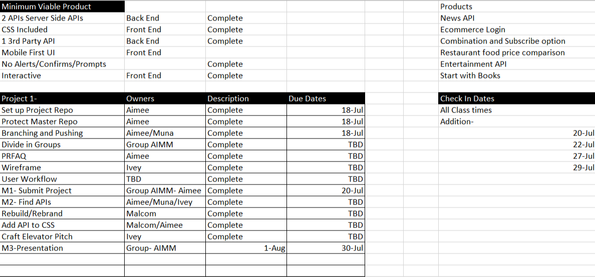
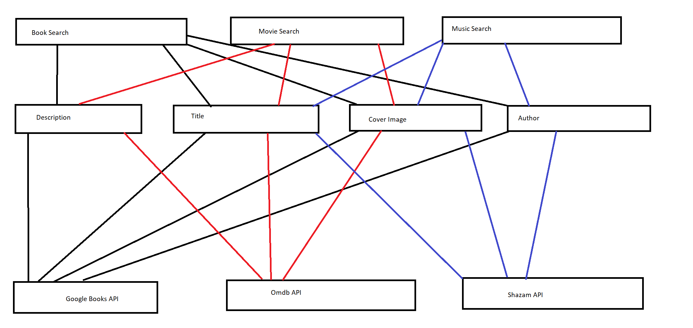

# Proj-1  Find It

Team 5: AIMM
Muna Ahmed
Aimee Tollett
Malcolm Felton
Ivey Lee

Introduction:
Our project idea is an online database of books where you enter the book you want to buy. Then the site will show the three cheapest options for purchasing the book. This changed as we looked deeper into the APIs. We wanted to solve for entertainment exhaustion and bring new ideas to life. We aim to inspire, help feel good, and entertain. 

Starting APIs: Open Book API, Goodreads, JSON, Shazam, Spotify, Music Match, Google Login, Amazon Musics, Amazon Product, Review, Keywords API

Used APIs:GoogleBooks API, OMDB API, Deezer API

Who is your audience? Bored people
What is the problem the product will address? Lack of entertainment
How does the product solve that problem? Showing the most reasonably priced book, Movie searches, and Music search by Artist or Track. Sample included

User Story
Who are we building this for?
What is the user trying to achieve?
Why do we want to achieve this?

Who: Someone that is looking for new entertainment
What: I want to explore new options 
Why: I have exhausted my current entertainment venues

Summation: To begin, with many people at home due to the pandemic. We wanted to go back to another time. In 2016 Udemy Workplace did a study and found that 43% of office workers are bored. I am not sure how that applies to Developers. 80% feel learning a new skill would make them more engaged. Great job as we all chose to take action and are in this class today. Last, bored workers are 2x more likely to leave. Fast forwarding to today, we are not in offices but at home. 

While we are at home, May 2019, Medium did a study of online search queries and found that online searches are about being Inspired, feel good, update socially ,entertain, find, be in the know, connect, and comfort. This led us to focus on helping people entertain, feel good, and inspire. Those 3 are 54% of the searches Medium studied. We want to help you Find It……

